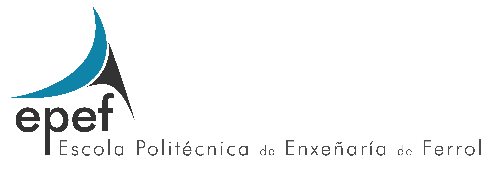
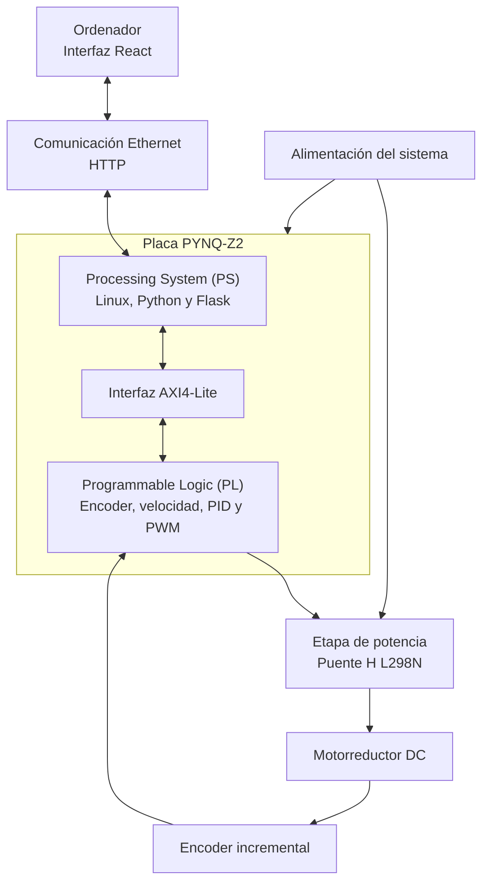

# Control de velocidad de un motor de corriente continua mediante PYNQ-Z2

<p align="center">
  
  &nbsp;&nbsp;&nbsp;&nbsp;&nbsp;&nbsp;
  
</p>

Este repositorio contiene el código fuente y los datos experimentales
asociados al Trabajo Fin de Grado **«Diseño e implementación de un sistema
de control de velocidad para un motor de corriente continua mediante la
placa PYNQ»**, realizado en el Grado en Ingeniería Electrónica Industrial
y Automática de la Universidade da Coruña.

## Descripción del proyecto

El proyecto desarrolla un sistema digital de control de velocidad para un
motorreductor de corriente continua con encoder incremental. La
implementación utiliza una placa PYNQ-Z2, basada en el dispositivo
Zynq-7000, que integra en un mismo dispositivo un sistema de procesamiento
y una región de lógica programable.

El lazo de control se ejecuta en la **lógica programable (PL)** de la
PYNQ-Z2, donde se realizan las siguientes operaciones:

- Decodificación en cuadratura de las señales del encoder.
- Cálculo periódico de la velocidad del motor.
- Ejecución del controlador P, PI o PID.
- Generación de la señal PWM.
- Control del sentido de giro del motor.

El **Processing System (PS)** ejecuta Linux, Python y el servidor Flask.
Su función es cargar el overlay, acceder a los registros del periférico
mediante AXI4-Lite y comunicar la implementación hardware con la interfaz
gráfica ejecutada en el ordenador.

## Arquitectura general



## Organización del repositorio

El contenido del repositorio se divide en dos directorios principales:

- [Código fuente](./codigo/): programas y archivos necesarios para
  implementar y ejecutar el sistema.
- [Datos experimentales](./datos-ensayos/): archivos CSV obtenidos durante
  la identificación y validación experimental.

### Código fuente

El directorio `codigo` contiene los siguientes grupos de archivos:

- Módulos hardware desarrollados en VHDL.
- Bancos de pruebas utilizados para la simulación.
- Archivos del overlay de la PYNQ-Z2.
- Servidor desarrollado mediante Python y Flask.
- Interfaz gráfica desarrollada mediante React y Vite.
- Programas de adquisición y análisis realizados en MATLAB.

La organización prevista es:

```text
codigo/
├── hardware-vhdl/
├── overlay-pynq/
├── servidor-flask/
├── interfaz-react/
└── matlab/
```

### Datos experimentales

El directorio `datos-ensayos` contiene los archivos CSV generados durante
los siguientes ensayos:

- Identificación dinámica del conjunto motor-L298N.
- Seguimiento de velocidad con un controlador proporcional.
- Seguimiento de velocidad con un controlador PI.
- Seguimiento de velocidad con un controlador PID.
- Comparación experimental de los controladores.
- Respuesta del sistema ante perturbaciones de carga.

La organización prevista es:

```text
datos-ensayos/
├── identificacion-motor/
├── comparacion-controladores/
└── perturbaciones-carga/
```

## Elementos principales del sistema

Los principales componentes empleados son:

- Placa de desarrollo PYNQ-Z2.
- Motorreductor JGB37-520 de corriente continua.
- Encoder incremental en cuadratura.
- Puente H L298N.
- Fuente de alimentación para la etapa de potencia.
- Ordenador conectado a la PYNQ-Z2 mediante Ethernet.

## Tecnologías utilizadas

Durante el desarrollo del proyecto se utilizaron las siguientes
tecnologías y herramientas:

- VHDL.
- Vivado Design Suite.
- AXI4-Lite.
- Python.
- PYNQ.
- Flask.
- React.
- Vite.
- MATLAB.
- GitHub.

## Funcionamiento general

El funcionamiento del sistema se basa en la siguiente secuencia:

1. El encoder genera las señales digitales asociadas al movimiento del
   eje del motor.
2. La lógica programable decodifica estas señales y calcula periódicamente
   la velocidad.
3. El controlador compara la velocidad medida con la referencia
   establecida.
4. A partir del error se calcula la acción de control.
5. El generador PWM transforma la acción de control en una señal adecuada
   para el puente H.
6. El L298N regula la potencia aplicada al motor.
7. El PS lee las variables del periférico y las proporciona al servidor
   Flask.
8. La interfaz React permite configurar y supervisar el sistema desde el
   ordenador.

## Puesta en marcha

De forma general, la ejecución del sistema requiere:

1. Copiar los archivos del overlay en la PYNQ-Z2.
2. Cargar el bitstream y acceder al periférico desde Python.
3. Ejecutar el servidor Flask en la PYNQ-Z2.
4. Iniciar la aplicación React en el ordenador.
5. Acceder a la interfaz gráfica desde el navegador.
6. Configurar la referencia y las ganancias del controlador.
7. Arrancar el sistema y supervisar su respuesta en tiempo real.

Las instrucciones específicas y los archivos necesarios se incluyen en
los directorios correspondientes.

## Datos experimentales

Los archivos CSV se conservan para permitir la consulta de las medidas,
la reproducción de las representaciones gráficas y la comprobación de los
resultados incluidos en la memoria.

Estos archivos contienen, entre otras variables:

- Tiempo transcurrido.
- Referencia de velocidad.
- Velocidad medida.
- Error de seguimiento.
- Ciclo de trabajo aplicado.
- Ganancias del controlador utilizado.

## Autor

**Héctor Rodríguez Terán**

Grado en Ingeniería Electrónica Industrial y Automática  
Escola Politécnica de Enxeñaría de Ferrol  
Universidade da Coruña  
Curso 2025/2026
