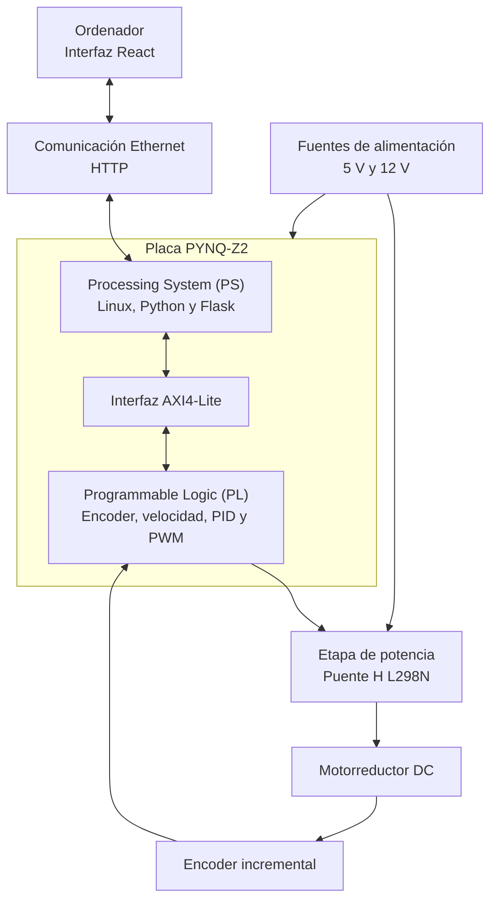

# Control de velocidad de un motor de corriente continua mediante PYNQ-Z2

<p align="center">
  
  &nbsp;&nbsp;&nbsp;&nbsp;&nbsp;&nbsp;
  
</p>

Este repositorio contiene el código fuente y los datos experimentales
asociados al Trabajo Fin de Grado **«Diseño e implementación de un sistema
de control de velocidad para un motor de corriente continua mediante la
placa PYNQ»**, realizado en el Grado en Ingeniería Electrónica Industrial
y Automática de la Universidade da Coruña.

## Descripción del proyecto

El proyecto desarrolla un sistema digital de control de velocidad para un
motorreductor de corriente continua con encoder incremental. La implementación
utiliza una placa PYNQ-Z2, basada en el dispositivo Zynq-7000, que integra en
un mismo dispositivo un sistema de procesamiento y una región de lógica
programable.

El lazo de control se ejecuta en la **lógica programable (PL)** de la
PYNQ-Z2, donde se realizan las siguientes operaciones:

- Decodificación en cuadratura de las señales del encoder.
- Cálculo periódico de la velocidad del motor.
- Ejecución del controlador P, PI o PID.
- Generación de la señal PWM.
- Control del sentido de giro del motor.

El **Processing System (PS)** ejecuta Linux, Python y el servidor Flask.
Su función es cargar el overlay, acceder a los registros del periférico
mediante AXI4-Lite y comunicar la implementación hardware con la interfaz
gráfica ejecutada en el ordenador.

## Arquitectura general



## Organización del repositorio

El contenido técnico del repositorio se organiza en dos directorios
principales:

- [Código fuente](https://github.com/hectorteran1205-hash/TFG_control_velocidad_PYNQ/tree/main/codigo):
  archivos desarrollados para implementar, ejecutar y analizar el sistema.
- [Archivos de ensayo](https://github.com/hectorteran1205-hash/TFG_control_velocidad_PYNQ/tree/main/archivos_ensayo):
  datos experimentales obtenidos durante la identificación y validación.

El directorio `imagenes` contiene únicamente los recursos gráficos utilizados
en este README.

La estructura general es la siguiente:

```text
TFG_control_velocidad_PYNQ/
├── codigo/
│   ├── hardware/
│   │   ├── archivos_importantes/
│   │   └── vhdl/
│   ├── herramientas_auxiliares/
│   └── software/
│       ├── interfaz_web/
│       └── servidor_pynq/
├── archivos_ensayo/
│   ├── comparacion_controladores/
│   ├── ensayo_carga/
│   └── identificacion_motor/
└── imagenes/
```

El directorio `codigo` contiene:

- Los módulos y bancos de pruebas desarrollados en VHDL.
- El archivo de restricciones de la PYNQ-Z2.
- El diseño de bloques realizado en Vivado.
- Los archivos `.bit` y `.hwh` que forman el overlay.
- El servidor Python y Flask ejecutado en el PS de la PYNQ-Z2.
- La interfaz gráfica desarrollada mediante React y Vite.
- Los programas auxiliares de adquisición y análisis realizados en MATLAB.

## Elementos principales del sistema

Los principales componentes empleados son:

- Placa de desarrollo PYNQ-Z2.
- Motorreductor JGB37-520 de corriente continua.
- Encoder incremental en cuadratura.
- Puente H L298N.
- Fuente de alimentación para la etapa de potencia.
- Ordenador conectado a la PYNQ-Z2 mediante Ethernet.

## Tecnologías utilizadas

Durante el desarrollo del proyecto se utilizaron las siguientes tecnologías
y herramientas:

- VHDL.
- Vivado Design Suite.
- AXI4-Lite.
- Python.
- PYNQ.
- Flask.
- React.
- Vite.
- MATLAB.
- GitHub.

## Funcionamiento general

El funcionamiento del sistema se basa en la siguiente secuencia:

1. El encoder genera las señales digitales asociadas al movimiento del eje
   del motor.
2. La lógica programable decodifica estas señales y calcula periódicamente
   la velocidad.
3. El controlador compara la velocidad medida con la referencia establecida.
4. A partir del error se calcula la acción de control.
5. El generador PWM transforma la acción de control en una señal adecuada
   para el puente H.
6. El L298N regula la potencia aplicada al motor.
7. El servidor Flask, ejecutado en el PS, accede a los registros del
   periférico mediante AXI4-Lite.
8. La interfaz React intercambia órdenes y variables de monitorización con
   el servidor Flask mediante peticiones HTTP.

## Puesta en marcha

De forma general, la ejecución del sistema requiere:

1. Copiar los archivos `.bit` y `.hwh` del overlay en la PYNQ-Z2.
2. Ejecutar `app.py` en la PYNQ-Z2. Este programa carga el overlay, accede
   al periférico AXI4-Lite e inicia el servidor Flask.
3. Instalar las dependencias de la interfaz mediante `npm install`, operación
   necesaria únicamente la primera vez.
4. Iniciar la aplicación React en el ordenador mediante `npm run dev`.
5. Acceder a la interfaz desde `http://localhost:5173`.
6. Configurar la referencia, las ganancias y el sentido de giro.
7. Arrancar el sistema y supervisar su respuesta en tiempo real.

Durante el funcionamiento deben mantenerse activos tanto el servidor Flask
de la PYNQ-Z2 como la aplicación React ejecutada en el ordenador.

Las instrucciones específicas y los archivos necesarios se incluyen en los
directorios correspondientes.

## Datos experimentales

Los archivos CSV se conservan para permitir la consulta de las medidas, la
reproducción de las representaciones gráficas y la comprobación de los
resultados incluidos en la memoria.

Los datos disponibles corresponden a:

- La identificación dinámica del conjunto motor-L298N.
- El seguimiento de velocidad con un controlador proporcional.
- El seguimiento de velocidad con un controlador PI.
- El seguimiento de velocidad con un controlador PID.
- La comparación experimental de los controladores.
- La respuesta del sistema ante perturbaciones de carga.

Estos archivos contienen, entre otras variables:

- Tiempo transcurrido.
- Referencia de velocidad.
- Velocidad medida.
- Error de seguimiento.
- Ciclo de trabajo aplicado.
- Ganancias del controlador utilizado.

## Autor

**Héctor Rodríguez Terán**

Grado en Ingeniería Electrónica Industrial y Automática  
Escola Politécnica de Enxeñaría de Ferrol  
Universidade da Coruña  
Curso 2025/2026
